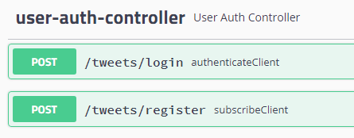
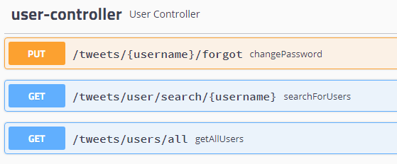
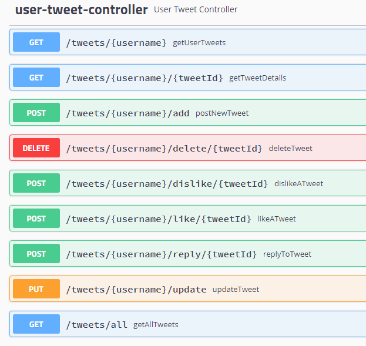
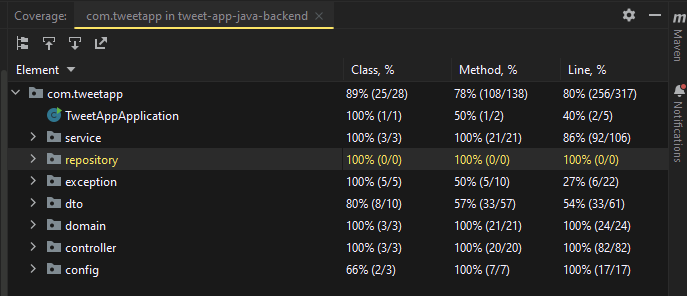

# TweetApp Api Service

* Tweet App API Service performs ```User Registration```, ```User Login```, 
```Post Tweets```, ```Like Tweets```, ```Delete Tweets```, ```Update Tweets```.
* This project was built using ```Java 8``` and uses ```MongoDB``` as database. 
* This project uses ```Spring Boot Framework Version 2.1.x```

# Steps to run in Local

* Before running app make sure you do ```mvn clean install```
* Run the application
* App should be up and running on port 8081
* Run all ```Rest Endpoints``` to check their responses

# Steps to run using Docker

* Run the ```docker-compose up``` command to start the application
* Keep both frontend and backend in same folder

# Prometheus
prometheus - http://localhost:8081/api/v1.0/actuator/prometheus

# Swagger Documentation
swagger - http://localhost:8081/api/v1.0/swagger-ui.html#/







# Unit Test & Code Coverage
used mockito-junit-jupiter 4.5.1 & junit-jupiter-api

* Steps to run test cases with coverage
* Right-click on ```com.tweetapp``` package inside test folder
* Select ```Run Tests in "com.tweetapp" with Coverage```
* Coverage Report will look like this

